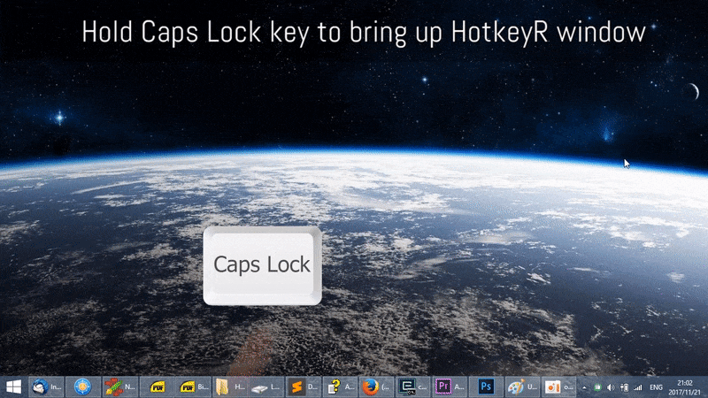

### HotkeyR 
A free, open-source, portable, fast **window switching tool**.

* E.g., to activate notepad++ from tons of your desktop windows, you simply hit `CapsLock + N` (notepad++ starts with `N`).
* Holding `CapsLock` key will bring up a alt-tab-like list allowing you to activate window by clicking.
* Clicking **always-on-top button** on the right to keep your window frontmost. 
* Try out yourself!

### Download
[HotkeyR-v1.1.zip](https://github.com/Gewerd-Strauss/HotkeyR/releases/download/v1.0/HotkeyR-v1.0.zip)
[HotkeyR-v1.0.zip](https://github.com/rossning92/HotkeyR/releases/download/v1.0/HotkeyR-v1.0.zip)

### Changelog
+ added different, short timeout for windows explorer
+ made default timeout longer
+ added autostart for host.ahk (can be ignored, mostly for my own convenience so that I don't loose its capabilities)
+ increased vertical size of GUI to accomodate more windows. Currently not adapting automatically, but I may look into it
+ moved GUI to the left edge of the screen to be less obtrusive
+ edited README.md